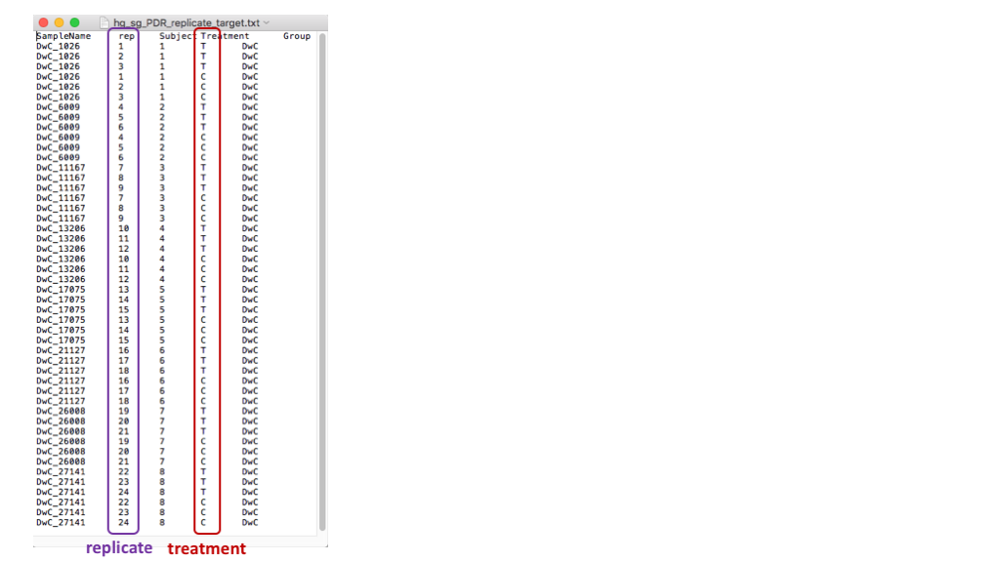

# Methods

## Table of Contents

- [PCA and Covariates](#pca-and-covariates)
- [DE models with and without collapsing data](#de-models-with-and-without-collapsing-data)
- [DE models with clinical covariates controlled](#de-models-with-clinical-covariates-controlled)

## PCA and Covariates

- To identify important covariates to condition on the differential expression (DE) analyses, we performed principal components analysis (PCA) and association testing between covariates and PCs .
We describe here how the effect of group was removed prior to performing the PCA.

   1. run PCA using the PCA function [prcomp](https://stat.ethz.ch/R-manual/R-devel/library/stats/html/prcomp.html) in R with metadata by: (1) using all the gene expression data and (2) after the patients group removed such that we can identify which covariate is the confounding factor.

      `pca<-prcomp(input_data, scale = FALSE, center = TRUE)`

   2. as a sanity check, explore the variance explained for each PC to look at the distribution.

   

   3. compute Pearson's correlation coefficient (r) between eigenvector and metadata. The p-value of 0.05 (1.3 in log scale) is considered as significant.

      `pca_meta_cor<-cor(pca$rotation, metadata)`

    

   4. Now, remove the group by retrieving the residual data from applying the linear regression model that yields the difference between the gene expression data of the dependent variable group (g) and the fitted values (g').

      `input_data_group_removed<-summary(lm(input_data~group))$residual`

   5. Then, repeat the step in ii and iii.
   
   

## DE models with and without collapsing data

- We evaluated the gene expression data in two different ways for DE analysis using (1) collapsing into a mean and (2) all replicates that fitted into a mixed model taking into account the correlation between repeated measures. We show an example with PDR that compares the gene expression between high glucose and stand glucose.

   1. with a mean data
      - build a disign matrix using the [model.matrix](https://www.rdocumentation.org/packages/stats/versions/3.4.3/topics/model.matrix) function for paired treatment.
         ```
         subject="avg_PDR"
         avg_PDR<-cbind(avg_PDR_hg,avg_PDR_sg)
         targets<-readTargets(paste("avg_hg_sg_",subject,"_target.txt", sep=''))
         Paired <- factor(targets$paired)
         Treat <- factor(targets$Treatment)
         design <- model.matrix(~Paired+Treat)
         fit <- lmFit(avg_PDR, design)
         fit<- eBayes(fit)
         ```
         
         
         
         

   2. with replicates
      - build a design matrix using the [model.matrix](https://www.rdocumentation.org/packages/stats/versions/3.4.3/topics/model.matrix) function with both replicates (purple box) and treatment (red box).
      Note that "C" and "T" in treatment stand for high glucose and standard glucose, respectively.

         ```
         subject="PDR_replicate”
         PDR<-input_data[,grep("PDR",colnames(input_data))]
         targets<-readTargets(paste("hg_sg_",subject,"_target.txt", sep=''))
         Treat <- factor(targets$Treatment,levels=c("C","T"))
         Replicates <- factor(targets$rep)
         design <- model.matrix(~Replicates+Treat)
         ```
        

        Then, use the [duplicateCorrelation](http://web.mit.edu/~r/current/arch/i386_linux26/lib/R/library/limma/html/dupcor.html) function to estimate the correlation between technical replicates using a mixed linear model that returns a consensus correlation, a robust average of the individual correlation. We use the the value to [lmFit](http://web.mit.edu/~r/current/arch/i386_linux26/lib/R/library/limma/html/lmFit.html).

         ```
         corfit <- duplicateCorrelation(PDR, block = targets$Subject)
         fit <-lmFit(PDR, design, block=targets$Subject, correlation=corfit$consensus.correlation)
         fit<-eBayes(fit)
         ```

         


         


## DE models with clinical covariates controlled

- Once the covariates (PC1 and growth rate) are identified, we eliminate them as a necessary predictor in DE models.
   - get PC1 after group regressed out as well as growth rate from metadata.

      ```
      pca_tmp<-pca$rotation
      pc1<-pca_tmp$PC1
      growth_rate<-meta[,"GROWTH_RATE"]
      ```

   - Using limma, the Bioconductor R pcakage:
      - build a design matrix.

         `design<-model.matrix(~pc1+growth_rate+group)`

      - Given a linear model fit, compute moderated t-statistics, moderated F-statistic, and log-odds of differential expression by empirical Bayes moderation of the standard errors towards a common value.


         `fit <- eBayes(lmFit(input_data, design))`

      - Then, apply FDR < 5% and log2(fold change) > 1 (or fold change > 2).

         ```
         qval.cutoff=0.05;
         FC.cutoff=2
         x1=topTable(fit, coef="group2", n=nrow(genes), p.value=qval.cutoff, adjust.method="BH", genelist=genes)
         ```

   - This gives 25 genes for difference between nDM vs. nPDR in high glucose.

   


---
below is Mike's notes:
---

. Address how the repeated measures are being
treated for analysis. Collapsing into a mean vs. fitted into a mixed model that takes into account
the correlation between repeated measures.

For genes found to be interesting based on the significance criteria above, we will investigate
if any of the association might be explained by a covariate that was not included in the model.
These include: A1C, Sex, Age, Duration, EBV copy number, BMI, LDL, HDL, Pulse, SBP, DBP, Triglycerides

Describe how results will be summarized. E.g. volcano plots, etc.

Summarize significant genes found in each group and how to determine which are shared and unique.
a.    Consider more liberal thresholds for allowing genes to be DE in different groups.
 i.         Require same direction?
ii.         Bonferroni threshold.
iii.         Calculate FDR in significant genes.

Describe gene set enrichment analysis (GSEA)
